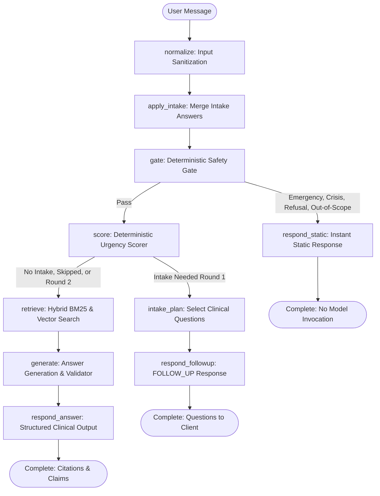

# AIRA Architecture and Pipeline Design

This document details the system architecture, deterministic orchestration graph, data flow, external API boundaries, and graceful degradation mechanisms of AIRA.

---

## 1. Orchestration Pipeline (LangGraph)

The core query lifecycle is orchestrated using a compiled LangGraph state machine. Safety checks run as deterministic Python code before any model invocation.

### Key Architectural Invariants:
1. As shown in the graph topology, any message flagged by the **Safety Gate** (such as red flags, trauma, pediatric queries, medication dosage requests, or self-harm) routes directly to `respond_static`. There is **no edge or pathway** from the static branch into `retrieve` or `generate`.
2. When follow-up questions are needed, `intake_plan` routes directly to `respond_followup`, which terminates at `__end__`. There is **no edge or pathway** from the follow-up branch into `retrieve` or `generate`. Zero model calls are made during intake question selection.
3. The server is completely stateless. The client sends original message and answers together in round 2. Intake answers can only raise urgency levels, never lower them.

---

## 2. Core Modules

| Module | Location | Purpose |
|---|---|---|
| `normalize` | `app/core/text.py` | Trims inputs, strips non-printable ASCII control characters, normalizes whitespace, and tokenizes text. |
| `intake` | `app/core/intake.py` | Validates intake payloads, parses answers into structured modifiers, selects condition or general sign questions, and strips clinical metadata before sending to client. |
| `gate` | `app/core/safety_gate.py` | Evaluates deterministic keyword and regex rules for emergency symptoms, crisis mentions, dosage/diagnosis refusals, and pediatric questions. |
| `score` | `app/core/scorer.py` | Evaluates symptom duration, clinical modifiers, and condition-specific red flags against the deterministic clinical rule table to assign the triage level. |
| `retrieve` | `app/core/retriever.py` | Fetches relevant clinical guideline chunks using reciprocal rank fusion of BM25 sparse keyword scores and dense vector embeddings. |
| `generate` | `app/core/generator.py` | Prompts Google Gemini with retrieved guideline chunks under strict schema constraints, or triggers extractive fallback if disabled/unverified. |
| `validators` | `app/core/validators.py` | Scans draft claims for prohibited dosing patterns, unauthorized drug names, diagnostic assertions, and ungrounded statements. |
| `respond_static` | `app/core/graph.py` | Assembles static emergency warnings, crisis hotlines, or refusal messages with zero LLM involvement. |
| `respond_followup` | `app/core/graph.py` | Assembles up to 3 static clinical questions with client-safe options and an optional 300 character note limit. |
| `respond_answer` | `app/core/graph.py` | Formats final response with triage level, validated claims, numbered source citations, answers summary, and disclaimers. |

---

## 3. Data Flow and Google Gemini API Boundary

AIRA minimizes external API exposure and enforces privacy by design.

### What is Sent to Google Gemini:
1. **Search Query (Embedding):**
   - When: During hybrid retrieval when `EMBEDDINGS_ENABLED=true`.
   - Content: Anonymized user symptom text only. No session ID, user IP, or personal identifiers are attached.
2. **Answer Generation Prompt (Chat Model):**
   - When: Only when the safety gate passes, clinical condition matches, and `LLM_ENABLED=true`.
   - Content: Standardized system prompt, retrieved clinical guideline text chunks, and user symptom query.

### What is NEVER Sent to Google Gemini:
- Emergency symptoms, suicidal ideation, poisonings, or trauma queries (intercepted by gate).
- User IP addresses, request IDs, device headers, or metadata.
- Triage level decisions (computed solely by local rule table).
- Citation mapping strings (constructed locally by chunk IDs).

---

## 4. Graceful Degradation and Failure Modes

AIRA follows a "move toward safety" principle when encountering failures:

### 1. Vector Embedding Failure
- Trigger: Gemini embedding API timeout, network error, or missing API key.
- Action: The retriever falls back transparently to sparse BM25 keyword matching over the 85 guideline chunks.
- Result: Clinical retrieval continues without interruption.

### 2. Model Failure, Timeout, or Rate Limit
- Trigger: Gemini generation error, 429 quota exhaustion, response timeout, or output validator rejection (e.g. ungrounded claims or hallucinated doses).
- Action: The generator automatically switches to `extractive` mode.
- Result: AIRA returns verbatim passages directly from the retrieved ICMR guideline chunks with the notice *"These are passages copied from the guideline."*

### 3. Missing Rules or Index Corruption
- Trigger: Missing rule YAMLs, chunk count mismatch, or corrupt vector files on startup.
- Action: The application fails the startup integrity check. `/api/ready` returns HTTP 503 with a machine-readable reason code (`rules_missing`, `index_corrupt`).
- Result: `/api/triage` rejects requests safely rather than serving unverified advice. `/api/health` continues returning 200 for container orchestrator monitoring.
